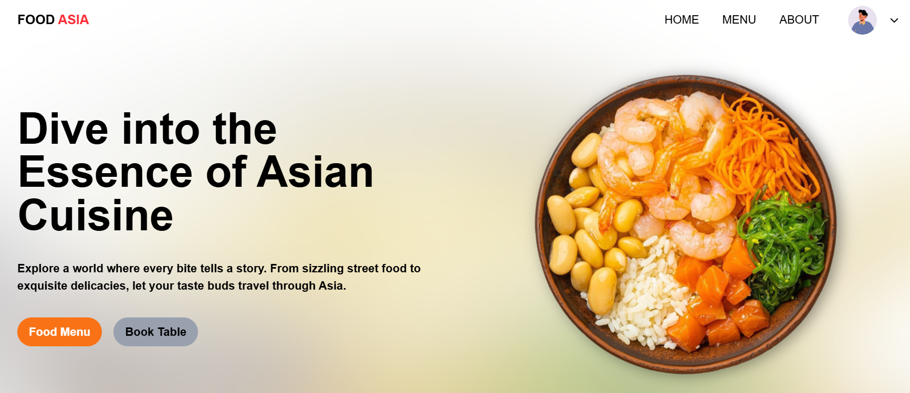
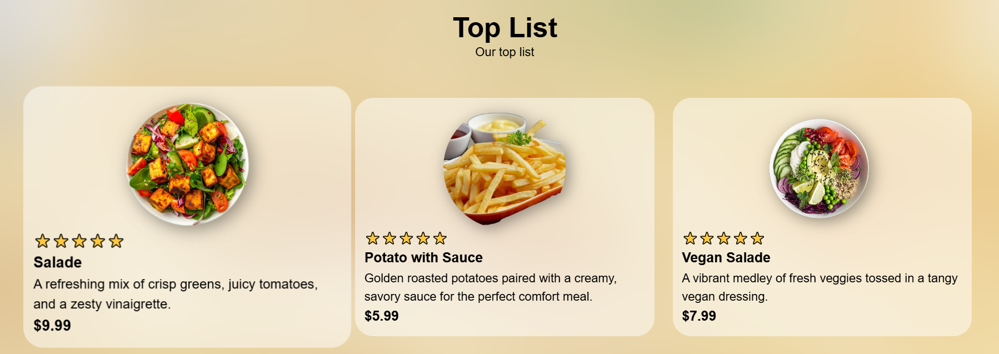
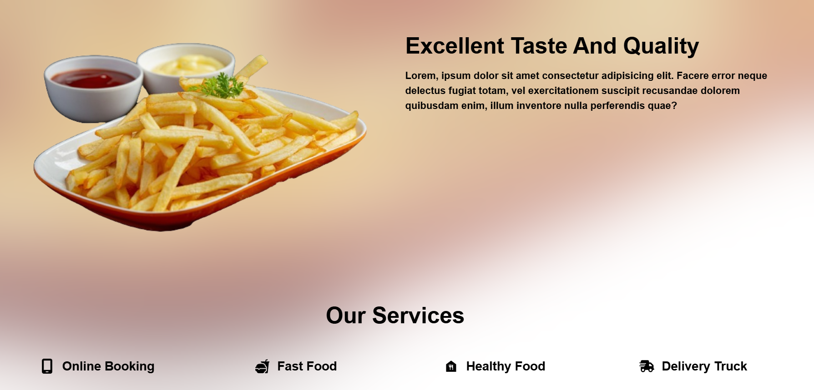

# 🍝 FoodAsia (React + Vite)

[Ссылка на проект в GitHub](https://github.com/HelenVirtanen/food-asia-react)

[Посмотреть на GitHub Pages](https://helenvirtanen.github.io/food-asia-react/)

## 📖 Описание проекта: 
"Foodasia" — это лендинг ресторана азиатской кухни с услугами доставки еды.

### 🧩 Элементы интерфейса:
* __Интро-блок с заголовком__ и анимацией (крутящимся блюдом);
* __Меню__ с карточками блюд, с ценой и описанием;
* __Отдельное блюдо__ с картинкой и описанием;
* __Список сервисов__.

## 🖼️ Скриншоты
### 🎏 Интро


### 📋 Список карточек меню 


### 🍣 Отдельное блюдо и навигация


## 🛠️ Применяемые технологии
* React
* Vite
* HTML
* CSS (включая адаптивную верстку)
* TailwindCSS
* PostCSS

## 🚀 Установка и запуск
**Локально**
1. Клонируйте репозиторий:
   git clone https://github.com/HelenVirtanen/food-asia-react
2. Перейдите в папку проекта:
   cd food-asia-react
3. Установите зависимости: 
   npm i
4. Запустите приложение:
   npm run start
   
Приложение будет доступно по адресу http://localhost:3000

**Для разработки**
```bash
npm run dev
# or
yarn dev
# or
pnpm dev
# or
bun dev
```

## Полезные ссылки
- [@vitejs/plugin-react](https://github.com/vitejs/vite-plugin-react/blob/main/packages/plugin-react) uses [Babel](https://babeljs.io/) for Fast Refresh